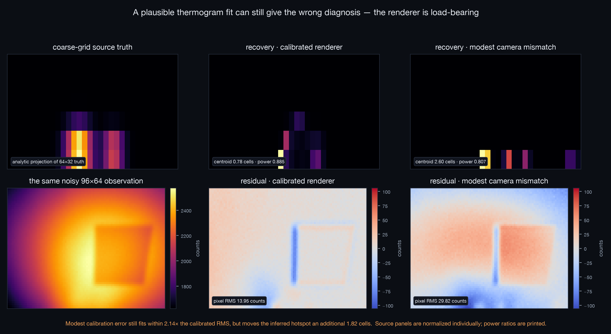

# Inverse rendering through a multiphysics equilibrium

**Tesseract Hackathon 2026 — Track 05: Differentiable graphics & rendering**

A thermal camera is a renderer. It takes a temperature field and produces an
image through Planck emission, surface emissivity, perspective projection,
optical blur, vignetting, and a sensor transfer function — every stage a
differentiable map. This entry builds that renderer as a Tesseract and then
points its gradients *backwards through a live multiphysics simulation*: from
the pixels of a single LWIR image, through the camera model, through a coupled
Fortran/JAX/PyTorch flow–heat equilibrium, to the hidden volumetric heat-source
map that produced the image. Differentiable rendering here is not a
visualization layer bolted onto a solver; it is the measurement model of an
inverse problem that cannot be posed without it.

## The differentiable chain

```text
counts = Camera(T*, emissivity, PSF, gain, offset)        JAX Tesseract
T* solves  T = Heat(gamma, Flow(gamma, Viscosity(T)); q)
                    JAX           Fortran        PyTorch

pixel loss -> camera VJP -> coupled implicit adjoint -> dJ/dq
```

Four components, four independent differentiation systems, one gradient:

- **Thermal camera** — JAX autodiff. Band-integrated Planck radiance over
  8–14 µm, grey opaque surfaces with reflected ambient, a homography with
  differentiable bilinear sampling, a Gaussian PSF whose *width* is itself
  differentiable, cos⁴ vignetting, and a gain/offset conversion to digital
  counts. Noise is added to measurements outside the gradient path.
- **Darcy/Brinkman flow** — Fortran, with a **hand-derived discrete adjoint**.
  No tape exists in this language; the adjoint is written by hand and checked
  against finite differences.
- **Heat transport** — JAX, differentiated through its fixed point by the
  implicit function theorem rather than by unrolling.
- **Viscosity closure** — PyTorch, a learned model with its own tape.

## Why Tesseract is essential

The component boundaries above are real, not decorative. A Fortran solver has no
autodiff to expose; PyTorch and JAX tapes cannot see each other; and the
coupled temperature field is defined implicitly by a fixed point, so no single
framework's tape could record it even in principle. Tesseract's contract — each
component publishes `apply` and `vector_jacobian_product` behind a typed
interface — is what lets a matrix-free implicit-function-theorem adjoint treat
a hand-written Fortran adjoint, two ML tapes, and a rendering VJP as
interchangeable parts of one chain rule. The fast judge and CI gates use
Tesseract's in-process API mode; the separate `make verify-containers` gate
builds and serves all four images, then finite-differences the complete
pixels-to-source derivative across the real HTTP/container boundaries. Remove
the Tesseract contract and you do not get a
slower version of this system; you get four gradients that cannot be composed.
The pixels→source derivative simply stops existing.

The problem is also not solvable component-by-component. Calibrating the camera
needs the physics to say what the plate actually looks like; recovering the
source needs the camera to say what the sensor actually measured; and the
flow–viscosity feedback couples every temperature to every other. Experiment B
quantifies exactly this: an arm that freezes the viscosity feedback — same
data, same prior, same optimizer — is biased relative to the full coupled
adjoint.

## Correctness gates

`scripts/verify_e2e_gradient.py` checks the complete pixels-to-source gradient
against central finite differences through the camera *and* the full coupled
equilibrium. On the declared 16×8 physics grid and 48×32 sensor:

| quantity | result |
|---|---:|
| best directional relative error | **3.6e-07** |
| required threshold | 1e-04 |
| verdict | **PASS** |

The independent served-container receipt also passes on an 8×4 / 24×16 smoke
composition at **1.14e-07** relative error in 67 seconds. It records all four
image IDs, execution mode, and source commit in
[`figures/container_e2e_gradient_check.json`](figures/container_e2e_gradient_check.json).

The fast suite adds 18 independent gates: Planck monotonicity,
emissivity/reflection limits, homography round trips, bilinear sampling, PSF
normalisation, vignetting, rendering behaviour, a temperature-VJP
finite-difference check, source metrics, regularisation, and optimisation
utilities. CI compiles the Fortran solver from source and runs the whole judged
surface on every push.

## Pre-registered experiments

The full protocol — grids, seeds, priors, optimizer settings, success criteria
— was committed before any reported run
([`writeup/PROTOCOL.md`](writeup/PROTOCOL.md)). Failures are reported at the
same volume as successes.

**A — camera self-calibration (inverse rendering).** From one image of a known
temperature field, recover the spatial emissivity map, PSF width, gain, and
offset across five fixed noise levels. Gain was recovered to 0.20–0.21%
relative error at every noise level. Separate PSF and offset estimates stayed
weakly identified from a single image (PSF absolute error 0.91 px, offset
relative error 19.0%) — the pre-declared gain/emissivity ambiguity, measured
and reported rather than hidden behind an image-loss number.

**B — source recovery through the physics.** From one noisy thermal image,
recover a 32×16 non-negative two-hotspot heat-source map, using the coupled
adjoint as the headline arm and frozen-viscosity physics as the comparison arm
against the same coupled measurement. The first registered run (v1) **failed
its pre-declared target** — coupled relative L2 error 0.9706 against a 0.5
criterion, centroid shift 6.85 cells — while still recovering total source
power to a 1.041 ratio versus 1.364 for the one-way arm. The protocol was then
amended (recorded in `PROTOCOL.md` as Amendment v2) and rerun as v2:

- Coupled arm: relative L2 error **0.1370** (pre-declared gate < 0.5: PASS),
  centroid shift **0.02 cells** (gate < 1.5: PASS), total-power ratio 1.000.
- Frozen-viscosity arm: relative L2 error **0.2457** — 1.79x the coupled
  error, with the final recorded data loss 65% above the noise floor (3.34 vs
  2.02). Both L-BFGS-B runs reached their 250-iteration limit, so this is a
  budget-matched endpoint, not a claimed convergence floor.
- Numbers from `figures/experiment_b_v2.json`; run log in
  `figures/sweeps/experiment_b_v2_run.log`.

All numbers above and in the writeup come from the checked-in,
seed-and-configuration-stamped artifacts in
[`figures/experiment_a.json`](figures/experiment_a.json) and
[`figures/experiment_b.json`](figures/experiment_b.json), with the recovered
field arrays in the matching NPZ files.

**C — renderer necessity under independent discretization.** Observations now
come from a 64×32 coupled solve and inversion runs at 32×16, eliminating the
same-grid inverse crime. Five budget-matched recoveries vary only the assumed
camera. The calibrated renderer localizes the source centroid within **0.78
cells**. A modest calibration mismatch (PSF 0.9 vs 1.2 px, gain +5%, offset
+10 counts, ambient +3 K, and a small FOV error) still fits within **2.14×**
the calibrated pixel RMS, but shifts the inferred hotspot to **2.60 cells** —
an additional **1.82-cell** diagnostic error. This passes the
committed-before-results criterion in
[`writeup/RENDERER_PROTOCOL.md`](writeup/RENDERER_PROTOCOL.md).

The result is not cherry-picked: blackbody and no-vignetting assumptions are
visibly rejectable, while removing the PSF does *not* hurt localization and
improves coarse-grid source L2. The supported claim is precise: camera
calibration is load-bearing for diagnosis; not every optical stage is.



## Why this matters outside a hackathon

Locating a hot component inside an electronics cooling assembly from a thermal
image is a standing industrial problem — the camera sees the plate surface, not
the die that is failing under it. Doing that inference honestly requires
exactly this stack: a radiometrically correct differentiable camera (an
uncooled microbolometer's counts are not temperatures), and gradients that pass
through the conjugate flow–heat physics coupling the source to the surface.
The same pattern — differentiable sensor model composed with a differentiable
equilibrium — covers pyrometry in additive manufacturing and non-destructive
thermographic inspection.

## Reproduce

Requires Python 3.10+ and `gfortran`; Docker is needed only for the explicit
served-container proof because every component can also run from its
`tesseract_api.py` in-process.

```bash
pip install -r requirements.txt
make judge         # submission audit + 18 fast gates, one PASS/FAIL verdict
make verify        # rerun the pixels-to-q finite-difference check
make verify-containers # build/serve 4 images + FD across real boundaries
make experiment-a  # camera self-calibration
make experiment-b-v2 # amended source recovery through the coupled equilibrium
make experiment-c  # renderer necessity with 64x32 truth / 32x16 inversion
```

`make judge` compiles the Fortran solver before running the gates. All host
dependencies are exactly pinned in `requirements.txt`; each Tesseract
carries its own pinned environment. `make judge` is the single command a judge
needs: it audits the submission surface, runs every fast gate, and prints one
verdict.

## License and provenance

Apache-2.0. The coupled physics core (Fortran flow solver and its hand-derived
adjoint, JAX heat transport, PyTorch viscosity closure, and the
implicit-adjoint coupler) originated in the same author's Track 02 repository;
[`NOTICE.md`](NOTICE.md) records exactly what was copied and what is new here.
The renderer, the pixels→source adjoint chain, and both inverse-rendering
experiments exist only in this repository.

Technical writeup: [`writeup/WRITEUP.md`](writeup/WRITEUP.md).
